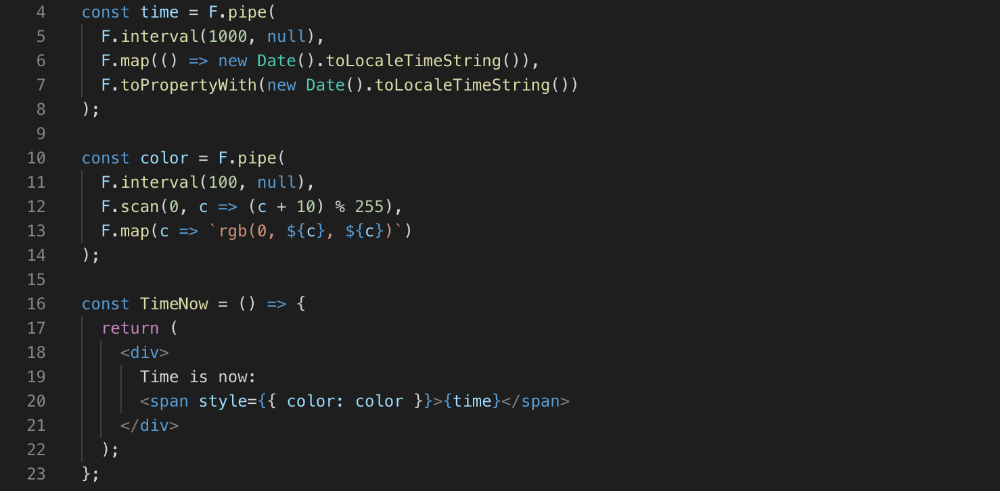
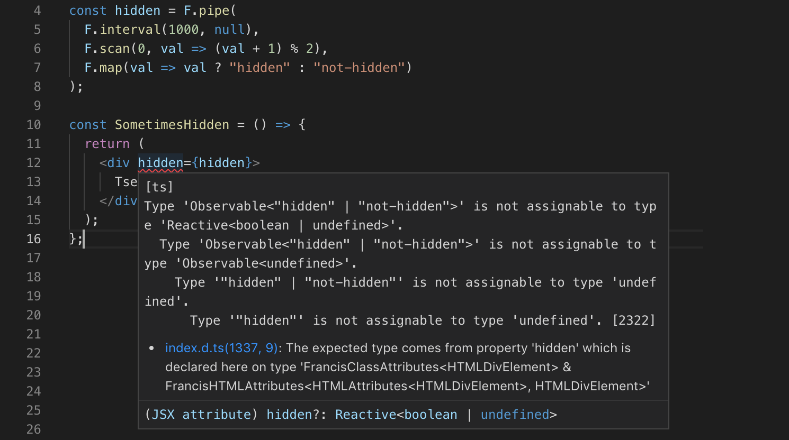

# `francis.react`

The official type-safe React bindings for [Francis](https://github.com/milankinen/francis).

[](https://travis-ci.org/milankinen/francis.react)
[](https://www.npmjs.com/package/francis.react)
[](https://bundlephobia.com/result?p=francis.react)

## Installation

**NOTE:** `francis.react` requires `francis >= 2.0.0` and `react >= 16.8.0-alpha.1` as a peer dependency so installing these packages is required to use `francis.react` package.

```bash
# npm
npm i --save francis.react francis react@next

# yarn
yarn add francis.react francis react@next
```

If you're using TypeScript, you also need to install `@types/react`

```bash
# npm
npm i --save @types/react

# yarn
yarn add @types/react
```

## Usage

### Compatibility with React

`francis.react` package has exactly same API and it uses the same internals as normal
React [package](https://www.npmjs.com/package/react). Because of this, all existing
components using `react` imports are compatible with `francis.react`, so the usage is
as simple as the following snippet:

```diff
-import React from "react"
+import React from "francis.react"

// ... rest of the app remains same ...
```

### Embedding observables

Observables can be embedded to the virtual DOM like any other value. When observable
emits a new value, the new value will trigger re-render of **only** the virtual DOM
node it belongs to. And if you're using TypeScript, all of this is checked by the
TS compiler:





### Custom hooks

#### `useStateAtom<T>(initialValue: T): Atom<T>`

This hook works like `useState` but instead of `[value, setter]` tuple, the
returned value is an `Atom` that preserves its state over re-renders:

```ts
interface CounterProps {
  state?: F.Atom<number>;
}

const Counter = ({ state = useStateAtom(0) }: CounterProps) => {
  return (
    <div>
      <p>Counter is: {state}</p>
      <div>
        <button onClick={() => F.modify(state, s => s + 1)}>++</button>
        <button onClick={() => F.modify(state, s => s - 1)}>--</button>
      </div>
    </div>
  );
};
```

#### `useSubscription<T>(f: (e: AnyEvent<T> ) => void, obs: Observable<T>): void`

Subscribes handler function `f` to the given `observable` **once** and disposes
the subscription when the component unmounts. This function is
[curried](https://en.wikipedia.org/wiki/Currying) so it can be piped like
normal Francis operators:

```ts
const Component = () => {
  F.pipe(
    F.interval(1000, 1),
    F.scan(0, (acc, s) => acc + s),
    useSubscription(e => {
      F.isNext(e) && console.log("Seconds since mount:", e.value);
    })
  );
  return <div>Tsers</div>;
};
```

### React Suspense compatibility

`francis.react` is compatbile with React Suspense. If any of the embedded
observables do not resolve (emit their first value) synchronously, the whole
sub-tree gets suspended. Handling suspension is done like in normal React apps:

```ts
interface ResultsProps {
  value: F.Observable<string>;
}

const Results = ({ value }: ResultsProps) => {
  return <div>Result is "{value}"</div>;
};

const Main = () => {
  const result = F.later(1000, "Tsers!");
  return (
    <React.Suspense fallback={<div>Loading...</div>}>
      <Results value={result} />
    </React.Suspense>
  );
};
```

### Server-side rendering

**SSR is not supported** at the moment. Support may come in future.

## License

MIT
